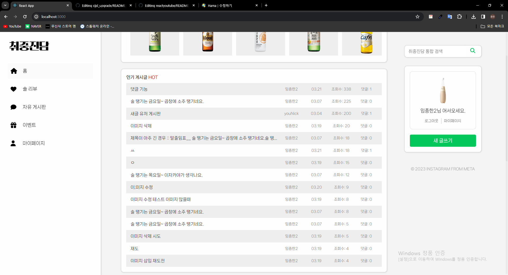
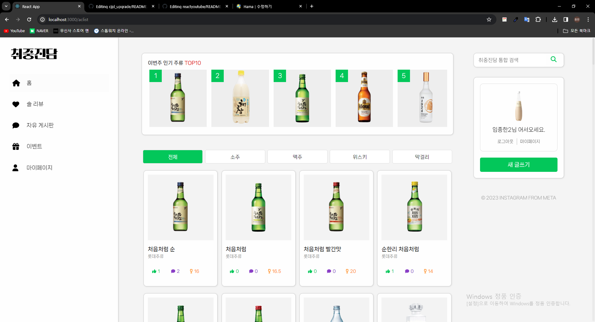
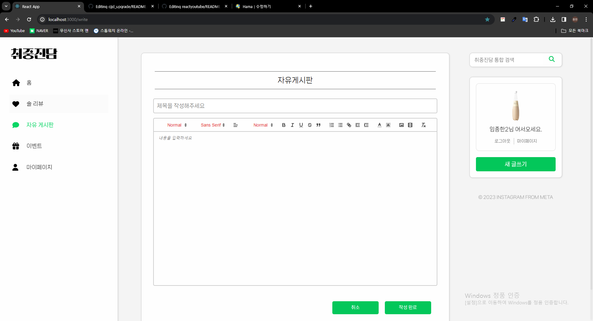

\*\* 
추가 개선 -> 캐싱, seo, 랜더링시 스켈레톤 ui
캐싱: 리액트 쿼리
seo: remix

 <h2>\*\* 취중진담 프로젝트 </h2>
 취중진담 프로젝트는 PHP, MySQL, JavaScript를 사용하여 팀 프로젝트로 개발되었던 웹사이트로, 현재는 React.js, Node.js, Express, MySQL을 사용하여 혼자서 리팩토링 및 마이그레이션을 진행 중입니다. 이 과정에서 TypeScript를 도입하여 정적 타입을 통한 개발 경험을 하고 있으며, 이미지 처리를 위해 multerS3와 Quill의 이미지 핸들러를 활용하고 있습니다. 또한, 사용자 인증 및 비밀번호 관리를 위해 JWT와 해시를 사용하고 있습니다.

 <h3>TypeScript 도입 경험</h3>
 정적 타입의 장점: TypeScript를 도입함으로써 코드의 안정성이 높아지고, 예상치 못한 런타임 에러를 줄일 수 있었습니다. 또한, 타입 에러를 통해 에러를 잡아주는 기능이 개발 속도 향상에 도움을 주었습니다.    
    
 라이브러리 호환 및 초기 컴파일 시간 문제: TypeScript 도입 과정에서 라이브러리 호환 문제와 초기 컴파일 시간이 증가하는 문제를 경험했습니다. 이를 해결하기 위해 이전 버전의 라이브러리 사용 및 번들링, 리액트 쿼리 사용 등을 고려하고 있습니다.

 <h3>이미지 처리 기능 개선</h3>
 multerS3와 Quill 이미지 핸들러 활용: 커뮤니티 기능의 완성도를 높이기 위해 이미지 처리를 위해 multerS3와 Quill의 이미지 핸들러를 사용하였습니다. 이미지 업로드 처리는 어렵지 않았으나, 게시글 수정 시 이미지 위치 설정이 어려웠습니다.

<h3>사용자 인증 및 비밀번호 관리</h3>
 JWT와 해시 사용: 사용자 인증 및 비밀번호 관리를 위해 JWT와 해시를 사용하고 있습니다. 이를 통해 사용자 인증을 강화하고, 비밀번호의 안전한 저장 및 관리가 가능해졌습니다.

이 프로젝트를 통해 TypeScript의 정적 타입을 통한 개발, 이미지 처리 기능의 개선, 사용자 인증 및 비밀번호 관리 등 다양한 기술을 경험하고 있습니다. 앞으로도 더 나은 웹 어플리케이션 개발을 위해 지속적으로 학습하고 개선해 나갈 예정입니다. 😊

<h3>설치 라이브러리</h3>
\*\* typescript       
npm i -g typescript    
Set-ExecutionPolicy -ExecutionPolicy RemoteSigned -Scope CurrentUser
tsc --init
server 
npm install --save-dev typescript @types/node @types/express

\*\* 클라이언트 라이브러리 설치   
npm i swiper   
npm i sass   
npm i axios   
npm i http-proxy-middleware   
npm i react-router-dom   
npm i react-redux   
npm i @reduxjs/toolkit   
npm i react-places-autocomplete   
npm i locomotive-scroll  

\*\* 서버단 라이브러리 설치
npm i nodemon   
npm i mysql   
npm i express   
npm install --save-dev ts-node-dev   
npm install jsonwebtoken bcryptjs   
npm install dotenv   

- 외래 키
-- 외래 키 검사 해제
SET FOREIGN_KEY_CHECKS=0;

-- 외래 키 검사 재활성화
SET FOREIGN_KEY_CHECKS=1;

<h3>\*\* TABLE </h3>
CREATE TABLE drinkMember(     
  myMemberId INT(10) UNSIGNED AUTO_INCREMENT,   
  youId VARCHAR(20) NOT NULL, 
  youPass VARCHAR(20) NOT NULL, 
  youName VARCHAR(5) NOT NULL, 
  youNick VARCHAR(10) NOT NULL, 
  youEmail VARCHAR(40) NOT NULL, 
  youBirth INT(8) NOT NULL, 
  youAddress VARCHAR(80) NOT NULL, 
  youImgFile VARCHAR(100) DEFAULT NULL, 
  youImgSize VARCHAR(100) DEFAULT NULL, 
  memberDelete BOOLEAN DEFAULT 1, 
  regTime INT(20) NOT NULL, 
  PRIMARY KEY(myMemberID) 
) CHARSET=utf8; 
  
CREATE TABLE drinkBoard ( 
  boardId INT(10) UNSIGNED AUTO_INCREMENT, 
  myMemberId INT(10) UNSIGNED NOT NULL, 
  boardCategory VARCHAR(10) NOT NULL, 
  boardTitle VARCHAR(255) NOT NULL, 
  boardContents LONGTEXT NOT NULL, 
  boardAuthor VARCHAR(10) NOT NULL, 
  boardView INT(100) NOT NULL, 
  boardLike INT(100) NOT NULL, 
  boardComment INT(100) NOT NULL, 
  boardImgFile VARCHAR(100) DEFAULT NULL, 
  boardImgSize VARCHAR(100) DEFAULT NULL, 
  boardDelete BOOLEAN DEFAULT 1, 
  regTime INT(40) NOT NULL, 
  PRIMARY KEY (boardId) 
) CHARSET=utf8; 
 
ALTER TABLE drinkBoard ADD CONSTRAINT FK_myMemberId FOREIGN KEY (myMemberId) REFERENCES drinkMember(myMemberId) ON DELETE CASCADE;
 
CREATE TABLE drinkLikes ( 
  likeId INT(10) UNSIGNED AUTO_INCREMENT, 
  myMemberId INT(10) UNSIGNED, 
  boardId INT(10) NOT NULL, 
  acId INT(10) UNSIGNED, 
  likeCategory VARCHAR(10) NOT NULL, 
  likeDelete BOOLEAN DEFAULT 1, 
  regTime INT(40) NOT NULL, 
  PRIMARY KEY (likeId) 
) CHARSET=utf8; 
 
ALTER TABLE drinkLikes ADD CONSTRAINT FK_myMemberId FOREIGN KEY (myMemberId) REFERENCES drinkMember(myMemberId) ON DELETE SET NULL, ADD CONSTRAINT FK_acId FOREIGN KEY (acId) REFERENCES drinkList(acId) ON DELETE SET NULL;
 
 
CREATE TABLE drinkComment ( 
  commentId INT(10) UNSIGNED AUTO_INCREMENT, 
  myMemberId INT(10) UNSIGNED, 
  boardId INT(10) NOT NULL, 
  acId INT(10) UNSIGNED, 
  commentCategory VARCHAR(10) NOT NULL, 
  commentName VARCHAR(20) NOT NULL, 
  commentPass VARCHAR(20) NOT NULL, 
  commentMsg VARCHAR(225) NOT NULL, 
  commentDelete BOOLEAN DEFAULT 1, 
  regTime INT(20) NOT NULL, 
  PRIMARY KEY (commentId) 
) CHARSET=utf8; 
 
ALTER TABLE drinkComment ADD CONSTRAINT FK_myMemberId FOREIGN KEY (myMemberId) REFERENCES drinkMember(myMemberId) ON DELETE SET NULL, ADD CONSTRAINT FK_acId FOREIGN KEY (acId) REFERENCES drinkList(acId) ON DELETE SET NULL;
  
CREATE TABLE drinkList ( 
  acId INT(10) UNSIGNED AUTO_INCREMENT, 
  acCategory VARCHAR(10) NOT NULL, 
  acImgPath VARCHAR(255) NOT NULL, 
  acName VARCHAR(40) NOT NULL, 
  acCompany VARCHAR(20) NOT NULL, 
  acDesc LONGTEXT NOT NULL, 
  acView INT(100) NOT NULL, 
  acLike INT(100) NOT NULL, 
  acComment INT(100) NOT NULL, 
  acAbv FLOAT NOT NULL, 
  acDelete BOOLEAN DEFAULT 1, 
  PRIMARY KEY (acId) 
) CHARSET=utf8; 
 
ALTER TABLE drinkList ADD CONSTRAINT FK_myMemberId FOREIGN KEY (myMemberId) REFERENCES drinkMember(myMemberId) ON DELETE CASCADE;
 
ALTER TABLE drinkLikes ADD CONSTRAINT FK_myMemberId FOREIGN KEY (myMemberId) REFERENCES drinkMember(myMemberId) ON DELETE CASCADE, ADD CONSTRAINT FK_acId FOREIGN KEY (acId) REFERENCES drinkList(acId) ON DELETE CASCADE;
